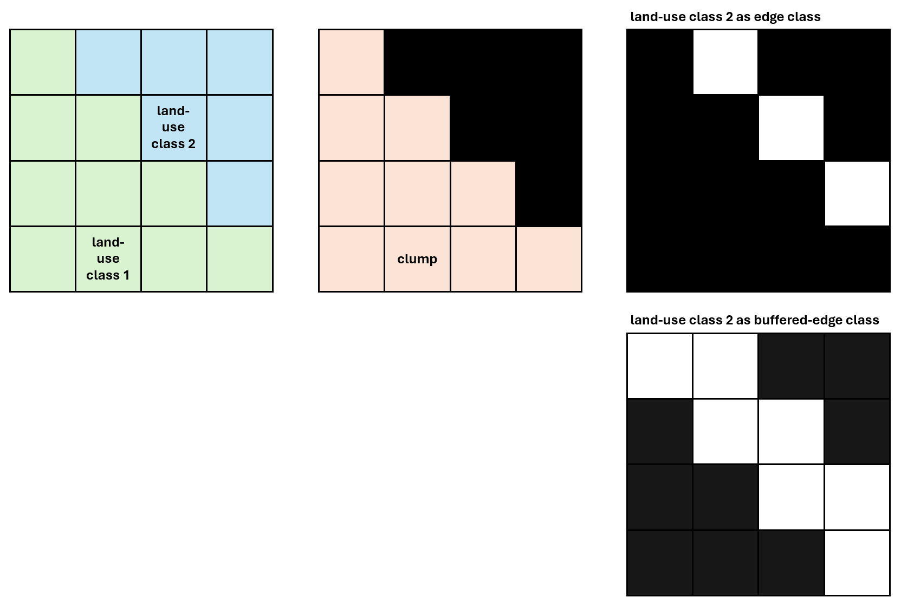

Detect edges
============

Edge detection is conducted for all specified edge classes, and for specified classes, edges will be buffered. 
The difference between the two types of edges is that the for edge classes, detected edges are spatially constrained to each actual patch of 
the land-use class, i.e., edges are within their respective patches. In the case of buffered-edge classes, edges will be buffered by one pixel. 
The latter type, buffered-edge, is particularly relevant for clump barriers that also hold recreational potential, as outlined in the following example:

Consider two land-use classes, e.g., forest (class 1) and water bodies (class 2). Both classes are relevant in a model (left), for example, 
forest as patches, and water bodies as edges. However, class 2 is also used as barrier class in clump detection, therefore, 
clumps as contiguous areas are separated by class 2 (water bodies), that are thus not part of clumps (middle). Since water bodies 
should however be considered in the estimation of supply etc., edges of water bodies need to be within clumps, as the estimation of 
indicators is bound to the extent of clump. Consequently, considering water bodies as edge classes (top right) is not sufficient, as the 
edge would not intersect the clump, and would therefore not be considered. Buffering the edge, i.e., in the case of buffered-edge classes, 
results in an intersection of the edge with the clump (bottom right).  

.. note::

    Outputs will be written per class into the MASKS subfolder. 
    
    
Depending on whether recreat is used from the CLI through recreat_util, or in a script, edges are detected as follows.

Using recreat_util from the CLI
-------------------------------

When using recreat_util, edges are detected through the ``detect-edges`` subcommand. This subcommand has the following options:

-i, --ignore            Ignore edges to the specified land-use class value.

Example:

.. code-block::
    
    recreat_util [...] detect-edges -i 0 [...]

As part of calling recreat using recreat_util, edges are detected through the ``detect-edges`` subcommand. 
In the example, as specified through the -i option, edges to class 0 will be ignored. The ``detect-edges`` subcommand will consider
all classes defined as edge or buffered-edge class.

.. note::
    
    Unlike in a script, edge classes including buffered-edge classes are specified through the params subcommand. 

In a script 
-----------

In a script, edges are detected through the :py:meth:`.detect_edges` method.

Example:

.. code-block:: python

    # previously, land-use classes 39 and 44 were defined as edge classes
    my_model.detect_edges(ignore_edges_to_class=0, buffer_edges=[44])

In this example, edge detection is run for all classes defined as edge class in the model, thus, classes with land-use value of 39 and 44. 
However, for the land-use class of value 44, edges will be buffered. For all edge classes, edges to land-use value of 0 will be ignored, 
and not included in the output.